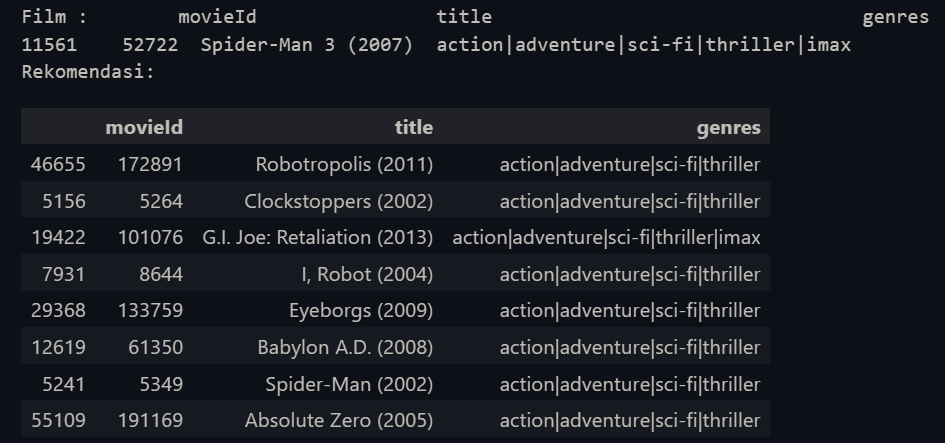

# Laporan Proyek Machine Learning - Sistem Rekomendasi Movies - Eka Yulianto

---

## Domain Proyek

Sistem rekomendasi adalah salah satu teknik yang sangat penting dalam meningkatkan pengalaman pengguna, khususnya di platform yang memiliki banyak konten, seperti aplikasi streaming film[1]. Dengan menggunakan sistem rekomendasi yang tepat, pengguna dapat dengan mudah menemukan film yang relevan dengan preferensi mereka. Pada proyek ini, kami mengembangkan sistem rekomendasi berbasis **content-based filtering**, dengan teknik **embedding** menggunakan **FastText** untuk menganalisis hubungan antar film berdasarkan judul dan genre yang digabungkan. Sistem ini bertujuan untuk memberikan rekomendasi film yang sesuai dengan genre yang diinputkan oleh pengguna.

---

**Referensi:**

1. [Kumar, M., Yadav, D. K., Singh, A., & Gupta, V. K. (2015). A movie recommender system: Movrec. International journal of computer applications, 124(3).](https://citeseerx.ist.psu.edu/document?repid=rep1&type=pdf&doi=e13eb41de769f124b3c91771167fb7b01bc85559).
2. [Rajarajeswari, S., Naik, S., Srikant, S., Sai Prakash, M. K., & Uday, P. (2019). Movie recommendation system. In Emerging Research in Computing, Information, Communication and Applications: ERCICA 2018, Volume 1 (pp. 329-340). Springer Singapore.](https://link.springer.com/chapter/10.1007/978-981-13-5953-8_28) 
3. [Reddy, S. R. S., Nalluri, S., Kunisetti, S., Ashok, S., & Venkatesh, B. (2019). Content-based movie recommendation system using genre correlation. In Smart Intelligent Computing and Applications: Proceedings of the Second International Conference on SCI 2018, Volume 2 (pp. 391-397). Springer Singapore.](https://www.riejournal.com/article_106395_c6c0038f1bf5d4c421bd552d0541d6be.pdf)
---

## Business Understanding

### Problem Statements

- Bagaimana cara memberikan rekomendasi film yang relevan berdasarkan genre yang diinputkan oleh pengguna?
- Bagaimana cara menganalisis hubungan antar film untuk menghasilkan rekomendasi yang sesuai, tanpa mengandalkan interaksi pengguna sebelumnya?
- Bagaimana menggunakan teknik embedding teks untuk mendapatkan representasi numerik dari gabungan judul film dan genre?

### Goals

- Membangun sistem rekomendasi berbasis content-based filtering yang dapat memberikan rekomendasi film berdasarkan genre input pengguna.
- Menggunakan teknik **FastText embedding** untuk menganalisis hubungan semantik antara judul film dan genre.
- Menggunakan **cosine similarity** untuk menghitung kesamaan antara film berdasarkan representasi embedding mereka.

### Solution Approach

1. **Content-Based Filtering**:  
   Sistem rekomendasi akan dibangun dengan menggabungkan judul film dan genre untuk menghasilkan representasi numerik menggunakan FastText. Dengan menggunakan cosine similarity, kita dapat menemukan film-film yang paling mirip berdasarkan input genre yang diberikan.

2. **FastText Embedding**:  
   Dengan menggunakan FastText, kita akan mengubah teks gabungan judul dan genre menjadi vektor yang mewakili semantik film. FastText memiliki kelebihan dalam menangani kata-kata yang jarang muncul atau belum pernah muncul dalam data pelatihan.

---

## Data Understanding

Dataset yang digunakan pada proyek ini terdiri dari 2 file, movies.csv dan ratings.csv. File **movies.csv** terdiri dari kolom `movieId`, `title` dan `genres` sedangkan pada **ratings.csv** terdiri `movieId`, `rating`, `userId` dan `timestamp`. 

**Variabel-variabel pada dataset:**
- **movieId**: ID unik untuk setiap film.
- **rating**: Rating yang diberikan oleh pengguna pada film tersebut.
- **title**: Judul film.
- **genres**: Genre film yang dipisahkan dengan tanda "|" (misalnya, "Adventure|Action|Sci-Fi").
- **timestamp**: Waktu pemberian rating.

Jumlah baris:
- movies.csv : **62,423**
- ratings.csv : **25,000,095**  

Dataset ini diambil dari [MovieLens Dataset Kaggle](https://www.kaggle.com/datasets/parasharmanas/movie-recommendation-system/data).

---

## **Data Preparation**

Pada tahap ini, data akan dibersihkan dan dipersiapkan untuk digunakan dalam model. Proses data preparation yang dilakukan antara lain:

1. **Menggabungkan `title` dan `genres`**:  
   Kolom `title` dan `genres` digabungkan menjadi satu string untuk digunakan sebagai input dalam teknik embedding FastText. Misalnya, "Toy Story (1995)" dengan genre "Adventure|Animation|Children" akan digabungkan menjadi:  
   `"Toy Story (1995) Adventure|Animation|Children"`

2. **Menghapus data yang tidak lengkap**:  
   Menghapus entri yang memiliki nilai kosong atau tidak lengkap pada kolom `title` dan `genres`.

3. **Tokenisasi dan Preprocessing Teks**:  
   Tokenisasi teks untuk mempersiapkan data yang lebih baik sebelum dimasukkan ke dalam model embedding.

---

## **Modeling**

Pada bagian ini, kami akan membahas model yang digunakan untuk sistem rekomendasi:

1. **Model Embedding FastText**:  
   FastText digunakan untuk mengubah teks gabungan `title` dan `genres` menjadi vektor dengan panjang dimensi 30. Model FastText di-train dengan 10 epochs untuk menghasilkan representasi semantik dari teks yang dapat dibandingkan antar film.

2. **Cosine Similarity**:  
   Setelah representasi vektor untuk setiap film diperoleh, kita akan menghitung **cosine similarity** antar vektor film. Cosine similarity digunakan untuk mengukur kedekatan antar vektor film, sehingga film dengan genre yang serupa akan mendapat skor similarity yang tinggi.

---

## **Evaluation**

Hasil percobaan jika kita menginputkan data nama film `Spider-Man (2007)`, maka hasil rekomendasi nya akan sebagai berikut :

Dapat dilihat bahwa rekomendasi yang diberikan merupakan film-film yang memiliki genre yang sama dengan `Spider-Man (2007)`, meskipun pada kenyataan-nya kurang secara konteks cerita dikarenakan kurangnya dataset yang menggambarkan karakteristik setiap film misal `sinopsis`, walaupun begitu sistem ini sudah dapat merekomendasikan dengan benar.
---

**Kesimpulan**:  
Model rekomendasi berbasis **content-based filtering dengan FastText dan cosine similarity** ini terbukti efektif dalam memberikan rekomendasi film yang sesuai dengan genre yang diinginkan. Hasil evaluasi menunjukkan bahwa sistem rekomendasi ini dapat menghasilkan rekomendasi yang relevan dan memadai untuk pengguna.
